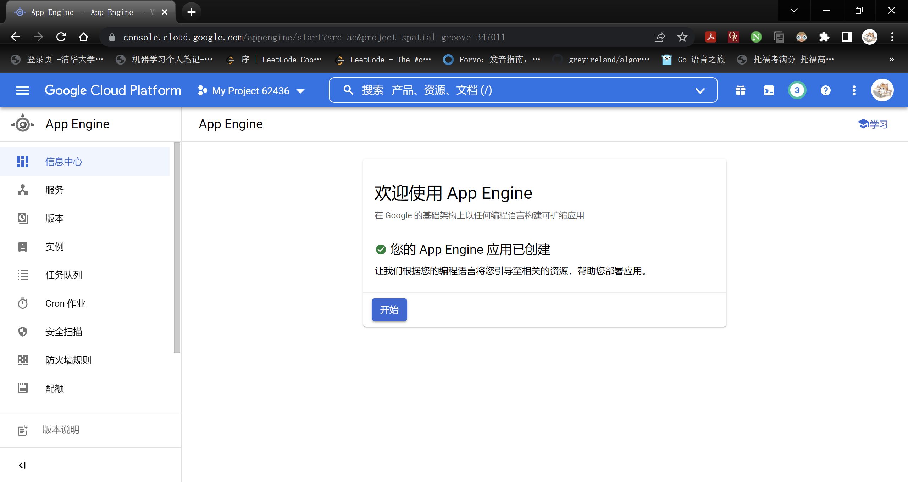

# 20.8 上传到云端

我们的留言簿应用程序使用谷歌账户认证用户，让他们提交信息，并显示其他用户留下的信息，让我们认为其基本功能完成了：我们现在将把它部署在云中。如果我们的应用程序会变得非常流行，我们不需要改变任何东西，因为 GAE 会自动处理扩展。

但是，首先你需要有一个谷歌账户，如 gmail 地址；你可以在 www.google.com/accounts 快速建立一个账户。

创建和管理 App Engine 网络应用程序是通过 App Engine 管理控制台网站进行的：https://appengine.google.com/

在快速的 SMS 验证程序之后，你会看到 "创建一个应用程序 "的页面。选择一个应用程序标识符 (*application identifier*)（对所有 GAE 应用程序来说是唯一的），如 ib-tutgae.appspot.com；加上前缀 http://，这将成为你的应用程序的网址。这个标识符以后不能更改，如果是私人应用程序，用你的名字缩写，如果是商业应用程序，用你的公司名称作为前缀是比较好的。然后选择一个应用程序的标题，这在您的应用程序中是可见的，并可以在之后更改，例如 "GAE 应用程序手册"。保留默认的谷歌认证和高复制数据存储，低于一定的配额之下，GAE 将免费运行您的应用程序。点击 "创建应用程序 "按钮后，将出现一个屏幕，显示 "应用程序成功注册 "的信息。

要在云中上传您的应用程序，请执行以下操作。
1) 编辑 app.yaml 文件，将 `application: setting` 的值从 `helloworld` 改为你注册的应用程序 `ib-tutgae`
2) 在 GAE 中上传和配置您的应用程序，使用脚本 appcfg.py 执行命令：`appcfg.py update helloapp/`

通过询问您的谷歌账户数据进行验证，如果一切成功，您的应用程序现在就可以部署在 App Engine 上了!

步骤 2) 必须在你每次上传新版本的应用程序时执行。

如果你看到编译错误，请修复源代码并重新运行 appcfg.py；在编译成功之前，它不会启动（或更新）你的应用程序。

在云端测试它：http://`application-id`.appspot.com

使用你自己独特的应用程序 ID (`application-id`)，在我们的例子中是 http://ib-tutgae.appspot.com

这也可以在 Windows 平台的浏览器中使用，而不仅仅是在 Linux 或 OS X 上。

<u>监控你的应用程序：</u>

再次访问 https://appengine.google.com/，现在将显示一个你的应用程序的列表。点击你的应用程序的链接将显示其控制面板 (*Control Panel*)，用于监控你的应用程序。

<u>Fig 20.1</u>:The Application Control Panel

这非常重要，因为你的应用程序在云中运行，而这是你访问它的唯一途径（除了用 app\_cfg 上传新的版本）！当你的应用程序在云中运行时，你不能对它进行或调试。当你的代码在云中运行时，你不能自己对它进行剖析 (profile) 或调试。有一个图像显示你的应用程序的负载（每秒钟的请求量），它消耗了多少资源（CPU 使用量、带宽、存储、复制的数据、后端使用量）以及如何计费。还有一个负载视图：每个 URL 模式的请求数和 CPU 负载，以及非常重要的一个错误视图：关于你的应用程序中发生的错误的摘要信息。数据面板，特别是数据存储查看器，可以让你可视化和查询你的存储数据。此外，还有用于管理的特定视图和 GAE 文档的链接。Main/Logs 让您可以访问应用程序的日志，每个请求和错误/异常都会被记录下来（异常不会显示给用户）。

## 链接

- [目录](directory.md)
- 上一节：[使用数据存储](20.7.md)
- 下一节：[21.0](真实世界中 Go 的使用)

